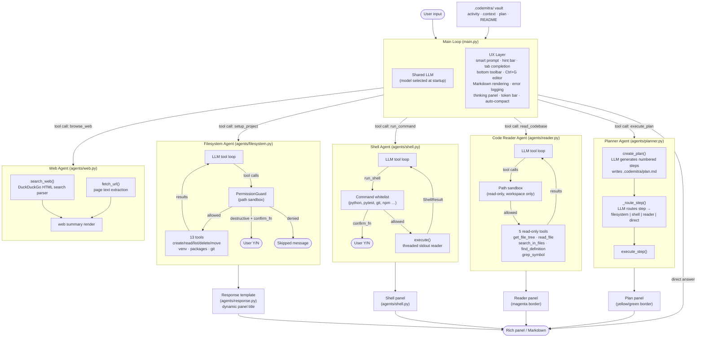
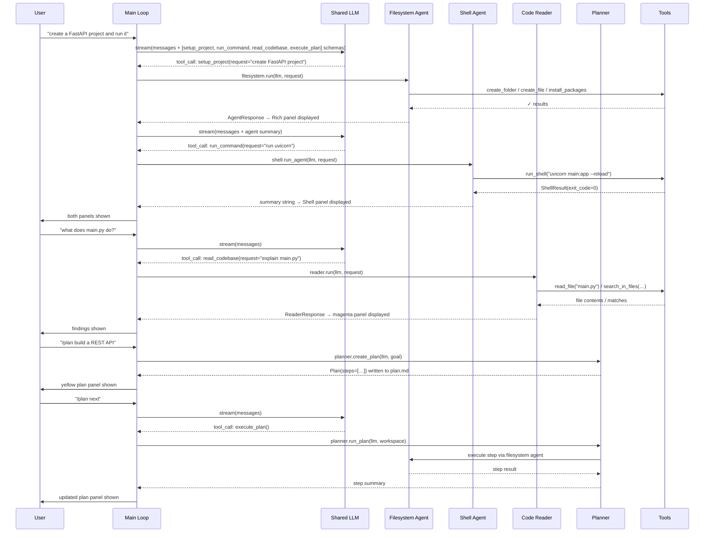

# Architecture

## Overview

CodeMitra uses a **shared-model, multi-agent** architecture. The main chat model is bound with routing tools for filesystem work, shell execution, code reading, planning, and web access. Each routing tool hands off to a dedicated sub-agent or helper flow that runs its own logic. Review, explain, session, and code-intelligence commands also run through dedicated helpers instead of raw free-form chat. No real action (filesystem, shell, file reading, or web lookup) happens outside a tool or explicit command path.

Use [[Multi-Agent System]] for the role split between agents, [[Product Blueprint]] for target product behavior, and [[Claude Code Reference]] / [[Claude Code Comparison]] for the benchmark context behind the next architectural steps.

---

## System diagram

---

## Component breakdown

### `app/main.py` — CLI entry point and chat REPL

- `codemitra init` — scaffolds `.codemitra/` memory vault (4 markdown files)
- `codemitra chat` — starts the interactive chat loop
- Picks model at startup (lists local Ollama models, supports refresh and removal)
- Binds five routing tools to the shared LLM: `setup_project`, `run_command`, `read_codebase`, `execute_plan`, `browse_web`
- Slash commands: `/init`, `/run <cmd>`, `/plan <goal>`, `/memory`, `/context`, `/status`, `/permissions`, `/skills`, `/skills show <name>`, `/search <query>`, `/open-url <url>`, `/diff`, `/review`, `/fix`, `/resume`, `/history`, `/rename`, `/tasks`, `/compact`, `/hibernate`, `/reset`, `/help`
- UX layer: smart prompt, hint bar, tab completion via `WordCompleter`, persistent bottom toolbar, `Ctrl+G` editor compose, turn separator `Rule`, Markdown/syntax highlighting in LLM responses, `_friendly_error()` with `.codemitra/errors.log`
- Startup context: auto-detects a concise workspace brief from README, entrypoints, dependencies, tests, and top-level files/folders, then injects it into the initial system prompt
- Skill context: discovers `skills/*/SKILL.md` and `.codemitra/skills/*/SKILL.md`, injects only the compact skill index, and reads full skill bodies on demand through the code reader
- Streaming: `main_llm.stream()` with automatic fallback to `invoke()` when tool calls are detected
- Inner-agent progress: blocking sub-agent `invoke()` and tool phases now show status spinners so web, reader, shell, and filesystem flows do not appear idle during summarization
- Thinking panel: `<think>…</think>` blocks extracted and shown in a dim panel before the reply
- Token bar: shows per-turn and session token totals with a fill gauge; `⚡ /compact` hint at 80% of threshold
- Auto-compact: when session tokens exceed `auto_compact_threshold`, LLM summarises history into a fresh message list; also triggered by `/compact`
- Low-memory recovery: `/hibernate` persists session memory, touches plan/session metadata, asks Ollama to unload the active model, runs garbage collection, and resets in-memory chat history
- Background task UX: `/run --background` starts tracked shell work, `/tasks` inspects it, and the toolbar/status surfaces live background task count

### `app/llm.py` — Model layer

- `get_llm(model, temperature)` — returns a `ChatOllama` instance for the selected model
- One shared LLM is used for all layers (main chat, filesystem agent, shell agent)

### `app/prompts.py` — System prompt

- Describes all five routing tools (`setup_project`, `run_command`, `read_codebase`, `execute_plan`, `browse_web`) with explicit routing rules
- Rules: file ops → `setup_project`; execution → `run_command`; list/inspect → `read_codebase`; plan next step → `execute_plan`; web lookup or URL reading → `browse_web`; questions → direct answer; call tools immediately

### `app/agents/brainstorm.py` — Pre-plan clarification agent

- `run(llm, goal, console)` → `str` — main entry point; returns accumulated Q&A context string
- Up to 5 rounds, max 3 questions per round
- Parses model output for `THINKING:`, `QUESTIONS:`, `READY_TO_PLAN` markers
- Returns early when model is confident it has enough context
- Called by `_cmd_plan()` in `main.py` before `create_plan()`

---

### `app/agents/filesystem.py` — Filesystem agent

Tools (13):

| Category | Tools |
|---|---|
| Files | `create_file`, `read_file`, `delete_file`, `move_file` |
| Directories | `create_folder`, `list_directory`, `delete_folder` |
| Environment | `create_venv`, `install_packages` |
| Git | `git_status`, `git_diff`, `git_commit` |
| Info | `get_cwd` |

Key components:
- `PermissionGuard` — path sandbox; every tool call is checked against the configured workspace
- `_DESTRUCTIVE_TOOLS = {"delete_file", "delete_folder", "move_file"}` — guarded by `confirm_fn`; confirmation check lives inside the tool itself so it applies whether called via agent loop or directly
- `configure(workspace, confirm_fn)` — sets workspace and optional confirmation callback
- `run(llm, request, console)` → `AgentResponse` — LLM tool loop
- `make_routing_tool(llm, console)` — wraps the agent as `setup_project` tool

### `app/agents/shell.py` — Shell agent

- `_DEFAULT_COMMANDS` whitelist: `python`, `pytest`, `git`, `npm`, `ruff`, `mypy`, `black`, `uvicorn`, …
- `ShellConfig` — workspace, allowed commands, default timeout, stream flag, confirm callback
- `ShellResult` — command, cwd, exit code, output lines, timed_out, denied flags; `.ok`, `.output`, `.tail`, `.to_llm_summary()`
- `execute(command, cwd, timeout, console)` — threaded stdout reader, streams live output, enforces timeout
- `BackgroundTask` registry — tracks `bg-*` tasks, recent output, status, timestamps, and stop requests for `/run --background` and `/tasks`
- `run_shell` — `@tool` for LangChain tool loop
- `run_agent(llm, request, console)` → `str` — NL shell request loop
- `make_routing_tool(llm, console)` — wraps as `run_command` tool
- `render(result)` — Rich Panel (green OK, red FAILED, yellow TIMEOUT)
- `configure(workspace, allowed_commands, default_timeout, stream_to_console, confirm_fn)` — module-level state

### `app/agents/reader.py` — Code Reader agent (read-only)

Tools (5, all read-only):

| Tool | Purpose |
|---|---|
| `get_file_tree` | Recursive directory listing, skips noise dirs (`.venv`, `__pycache__`, `node_modules`, …) |
| `read_file` | Pageable file reader (200-line cap, line-number gutter) |
| `search_in_files` | Regex search across files with glob filter |
| `find_definition` | Locate `def`/`class`/constant declarations by name |
| `grep_symbol` | Find all usages of a symbol across the workspace |

Key components:
- Path sandbox via `_check(path)` — never reads outside the configured workspace
- `configure(workspace)` — sets workspace (no `confirm_fn` needed — read-only)
- `run(llm, user_request, console)` → `ReaderResponse` — LLM tool loop
- `make_routing_tool(llm, console)` — wraps as `read_codebase` tool
- `render(response)` — magenta-bordered Rich Panel

### `app/agents/planner.py` — Planner agent

- `Step(index, text, done)` / `Plan(goal, steps)` — data model; `.pending`, `.completed`, `.is_done`
- `_parse_plan(workspace)` → `Plan | None` — reads `.codemitra/plan.md` into the data model
- `create_plan(llm, goal, workspace, context="")` → `Plan` — LLM generates numbered steps; writes `plan.md`; `context` is the brainstorm Q&A string
- `render(plan)` → Panel — yellow (in progress) or green (done) bordered table of steps
- `_route_step(llm, step_text)` → `"filesystem" | "shell" | "reader" | "direct"` — LLM routing
- `execute_step(llm, step, workspace, console)` → `str` — runs one step via the appropriate agent
- `run_plan(llm, workspace, console, max_steps)` → `str` — executes the next pending step(s)
- `make_routing_tool(llm, workspace, console)` — wraps as `execute_plan` tool

### Dedicated helper agents

- `app/agents/reviewer.py` — review flow used by `/review`
- `app/agents/explainer.py` — file-level explanation flow used by `/explain`
- `app/agents/codeintel.py` — definitions / references workflow used by `/symbols`
- `app/agents/session.py` — session naming, resume, compact, and hibernation helpers

- `ToolResult(tool, args, output, ok)` — one tool execution step
- `AgentResponse(steps, summary)` — full agent run; `.ok_count`, `.fail_count`
- `_panel_title(response)` — dynamic title based on tools used (Git, Installing packages, Removing files, …)
- `render(response)` — Rich Panel with steps table, summary, dynamic title

### `app/memory.py` — Obsidian-compatible memory vault

Files in `<workspace>/.codemitra/`:

| File | Purpose |
|---|---|
| `activity.md` | Append-only log of tool actions |
| `context.md` | Current project context (editable) |
| `plan.md` | Numbered task plan with completion markers |
| `README.md` | Vault index |
| `session.json` | Session name, trust state, hibernation metadata, and related UX state |

Key functions: `init_memory(workspace)`, `append_activity()`, `load_context()`, `update_context()`, `load_plan()`, `write_plan()`, `mark_step_done()`

### `app/skills.py` — Workspace skill registry

- Discovers skills from configured workspace directories
- Parses `SKILL.md` frontmatter for `name` and `description`
- Formats a compact startup prompt index without loading every skill body into context
- Keeps skill files inside workspace scope

### `misc/ascii.py` — Banner art

- Converts an image to ASCII art using Pillow + NumPy
- Used in `show_banner()` to render the CodeMitra avatar

---

## Message flow

---

## Test suite

Tests live in `tests/`. Run with `python -m pytest tests/ -v`.

| File | Coverage |
|---|---|
| [tests/test_filesystem.py](../tests/test_filesystem.py) | PermissionGuard, destructive confirm, create_file, list_directory |
| [tests/test_shell.py](../tests/test_shell.py) | Whitelist, confirm_fn, ShellResult, render |
| [tests/test_response.py](../tests/test_response.py) | `_panel_title`, ToolResult.ok, AgentResponse counts, step truncation |
| [tests/test_main_ux.py](../tests/test_main_ux.py) | `_friendly_error`, `_extract_command`, slash commands, `_make_completer` |
| [tests/test_prompts.py](../tests/test_prompts.py) | System prompt content and routing rules |
| [tests/test_reader.py](../tests/test_reader.py) | `get_file_tree`, `read_file`, `search_in_files`, `find_definition`, `grep_symbol`, path guard |
| [tests/test_planner.py](../tests/test_planner.py) | `_parse_plan`, `render`, Step model, `run_plan` guards, `auto_compact_threshold` config |

---

## Design decisions

### Why one shared model?

Early versions used two separate model instances (one for chat, one for agents). In practice, the same model works well for both roles — it already needs to do tool calling in the agent loops. Using one instance simplifies configuration: the user picks a model once at startup and it is used everywhere.

### Why a permission guard?

Without a guard, the agent LLM could be instructed (by a malicious prompt or a hallucination) to delete arbitrary files or run dangerous commands. The guard enforces:
- All paths must be inside the configured workspace directory
- Only whitelisted executables can be run via `run_command`
- Destructive operations require explicit user confirmation

See [[reference/Permissions]] for details.

### Why move confirm_fn into the tool itself?

Placing the confirmation check inside `delete_file`, `delete_folder`, and `move_file` (rather than only in the agent loop) ensures safety regardless of how the tool is called — agent loop, direct `.invoke()` in tests, or future CLI shortcuts. The guard is co-located with the action.

### Why structured response templates?

Plain string returns from agents are hard to display consistently and hard to act on programmatically. `AgentResponse` separates the step log from the summary, makes success/failure counts explicit, and lets the renderer build a clean Rich panel with a dynamic title regardless of what the agent did.
