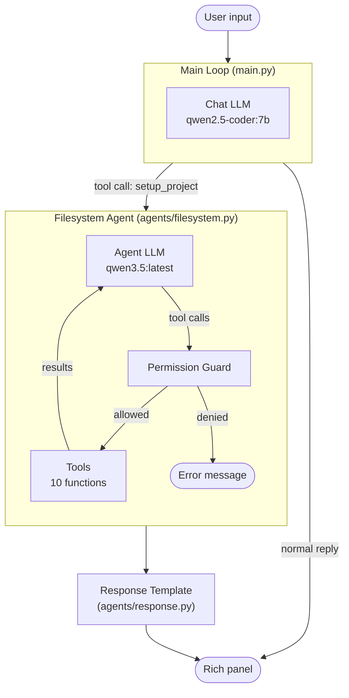
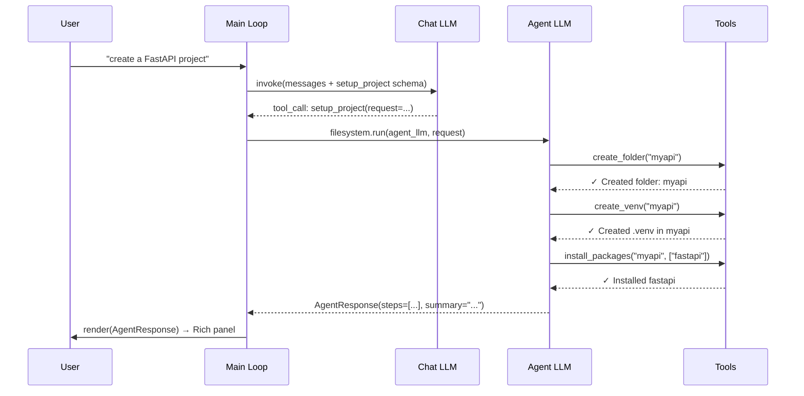

# Architecture

## Overview

CodeMitra uses a **dual-model, multi-agent** architecture. The chat model handles conversation; the agent model handles tool execution. Neither touches the filesystem directly — all real actions go through typed Python functions (tools).

---

## System diagram

---

## Component breakdown

### `app/main.py` — Entry point and main loop

- Renders the banner
- Creates both LLM instances
- Binds `setup_project` routing tool to the chat LLM
- Runs the chat loop: reads input → invokes LLM → handles response or tool calls

### `app/llm.py` — Model layer

Two functions:

| Function | Model | Purpose |
|---|---|---|
| `get_chat_llm()` | `qwen2.5-coder:7b` | Chat, code explanation, code generation |
| `get_agent_llm()` | `qwen3.5:latest` | Tool calling, agent execution |

### `app/agents/filesystem.py` — Filesystem agent

- Defines all 10 tools as `@tool` decorated functions
- `PermissionGuard` sits in front of every tool call
- `run(llm, request)` — the agent loop: invoke → tool calls → execute → feed results back → repeat until done → return `AgentResponse`
- `make_routing_tool(llm)` — wraps the agent as a single tool the chat LLM can call

### `app/agents/response.py` — Response templates

- `ToolResult` — one tool execution (tool name, args, output, ok/fail)
- `AgentResponse` — all steps + final summary + counts
- `render(response)` — builds a Rich Panel with steps table, summary, and footer

### `misc/ascii.py` — Banner art

- Converts an image to ASCII art using Pillow + NumPy
- Used in `show_banner()` to render the monkey avatar

---

## Message flow

---

## Design decisions

### Why two models?

`qwen2.5-coder:7b` is specialised for code and gives better chat/generation responses. But it does not support structured tool calling via Ollama's API — it outputs tool calls as plain text. `qwen3.5:latest` does support structured tool calling properly. Using both gives the best of each.

See [[reference/Models]] for the full comparison.

### Why a permission guard?

Without a guard, the agent LLM could be instructed (by a malicious prompt or a hallucination) to delete arbitrary files or run dangerous commands. The guard enforces:
- All paths must be inside a configured workspace directory
- Only whitelisted executables can be run via `run_command`
- Destructive tools are off by default

See [[reference/Permissions]] for details.

### Why structured response templates?

Plain string returns from agents are hard to display consistently and hard to act on programmatically. `AgentResponse` separates the step log from the summary, makes success/failure counts explicit, and lets the renderer build a clean Rich panel regardless of what the agent did.
