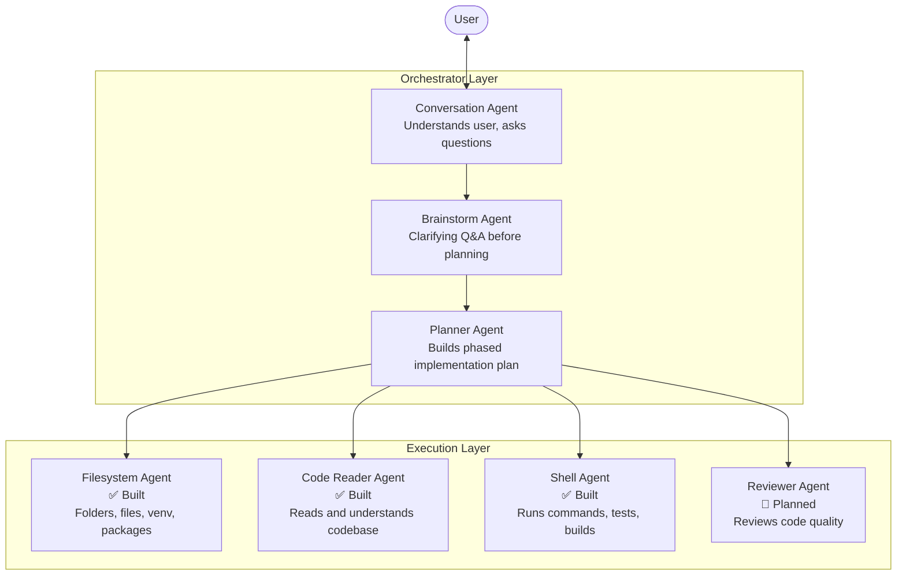

# Multi-Agent System

## The core idea

A single model trying to do everything — chat, plan, write code, read files, run commands — is going to be mediocre at all of it. The solution is the same one used in software engineering: **separation of concerns**.

Each agent has one job. Each agent uses the model best suited for that job. A planner routes work between agents. The user only talks to one interface.

---

## Agent roster



---

## Each agent in detail

### Conversation Agent
**Status:** ✅ Built (main chat loop)
**Model:** `qwen2.5-coder:7b`

Responsibilities:
- Maintains conversation with the user
- Understands what the user wants to build
- Detects when a task requires action and routes to the right agent
- Asks clarifying questions when the request is ambiguous
- Presents results back to the user in plain language

This is the only agent the user ever directly interacts with. Everything else is invoked transparently.

---

### Brainstorm Agent
**Status:** ✅ Built (Phase 9)
**Model:** same model as Conversation Agent

Responsibilities:
- Runs before every `/plan` command
- Generates up to 3 clarifying questions per round (max 5 rounds)
- Detects when it has enough context (`READY_TO_PLAN` signal)
- Returns full Q&A context string — passed to `create_plan()` so steps are specific, not generic

```
/plan build a REST API
  ↓
Brainstorm Agent asks:
  1. What framework? (FastAPI / Flask / Django)
  2. Do you need authentication?
  3. Which database?
  ↓
User answers
  ↓
Planner receives answers → generates specific, actionable steps
```

This mirrors exactly how Claude Code works — ask before acting.

---

### Planner Agent
**Status:** ✅ Built (Phase 7)
**Model:** `qwen3.5:latest`

Responsibilities:
- Takes a problem statement from the Conversation Agent
- Identifies ambiguities and surfaces them as questions
- Builds a phased, ordered implementation plan
- Breaks the plan into tasks assigned to specific agents
- Tracks progress and handles partial failures

Example output:
```
Phase 1: Project setup
  → Filesystem Agent: create project folder, venv, install deps

Phase 2: Core models
  → Code Writer: create User model, Post model

Phase 3: API routes
  → Code Writer: create /users, /posts endpoints
  → Code Reader: verify route structure matches models

Phase 4: Tests
  → Shell Agent: run pytest, report failures
  → Code Writer: fix failing tests
```

---

### Filesystem Agent
**Status:** ✅ Built (Phase 3)
**Model:** `qwen3.5:latest`
**Tools:** `create_folder`, `create_file`, `read_file`, `list_directory`, `delete_file`, `delete_folder`, `move_file`, `create_venv`, `install_packages`, `run_command`

See [[agents/Filesystem Agent]] for full documentation.

---

### Code Reader Agent
**Status:** ✅ Built (Phase 5)
**Model:** `qwen2.5-coder:7b`

Responsibilities:
- Reads the codebase and builds an understanding of its structure
- Answers questions: "what does X do?", "where is Y defined?"
- Identifies patterns, dependencies, entry points
- Feeds context to the Planner and other agents

Tools (all read-only):
- `read_file` — pageable file reader with line-number gutter
- `list_directory` — directory listing
- `get_file_tree` — full nested directory tree (skips noise dirs)
- `search_in_files` — regex search across files with glob filter
- `find_definition` — locate `def`/`class`/constant by name
- `grep_symbol` — find all usages of a symbol

---

### Shell Agent
**Status:** ✅ Built (Phase 6)
**Model:** `qwen3.5:latest`

Responsibilities:
- Runs shell commands and captures output
- Runs test suites and parses results
- Starts/stops servers
- Feeds command output back to the Planner or Code Writer

Tools:
- `run_shell` — execute whitelisted commands with timeout
- Streaming stdout back to the LLM mid-run
- `ShellResult` — exit code, output lines, timed_out, denied flags

---

### Reviewer Agent
**Status:** 🔲 Planned
**Model:** `qwen2.5-coder:7b`

Responsibilities:
- Reads generated code files
- Checks for correctness, style, security issues
- Produces structured feedback (pass / warn / fail per file)
- Requests changes from the Code Writer if issues are found

---

## The conversation and clarification flow

When the user gives an ambiguous or incomplete request, the system should ask — not guess.

```
User: "build me a REST API"
   ↓
Conversation Agent detects: incomplete — missing stack, auth, models, endpoints
   ↓
Planner generates clarifying questions:
  1. What framework? (FastAPI / Flask / Django)
  2. What data models do you need?
  3. Do you need authentication?
  4. Database? (SQLite / PostgreSQL / MongoDB)
  5. Should I include tests?
   ↓
User answers questions
   ↓
Planner builds implementation plan
   ↓
Execution begins, phase by phase
   ↓
Each phase is confirmed with the user before proceeding
```

This mirrors exactly how Claude Code works — it asks before acting on ambiguous requests.

---

## Project documentation as a first-class output

Every project CodeMitra works on should have a `.codemitra/` folder created automatically:

```
your-project/
├── .codemitra/
│   ├── context.md        # What this project is, stack, entry points
│   ├── plan.md           # The current implementation plan
│   ├── session-log.jsonl # History of all agent actions
│   └── decisions.md      # Why certain choices were made
├── docs/                 # Obsidian vault (if enabled)
│   ├── Home.md
│   ├── Architecture.md
│   └── ...
└── <your project files>
```

When CodeMitra starts on a project:
1. Checks for `.codemitra/context.md` — loads existing context
2. If new project: runs Code Reader Agent to understand the codebase
3. Writes a context file so the next session knows where things stand

This is what gives CodeMitra memory across sessions.

---

## How agents are connected technically

```python
# Each agent is a function that takes an LLM and a request,
# runs a tool-calling loop, and returns a structured response.

def run(llm, user_request: str) -> AgentResponse:
    active_tools = _guard.filter_tools(_ALL_TOOLS)
    llm_with_tools = llm.bind_tools(active_tools)
    messages = [SystemMessage(prompt), HumanMessage(user_request)]

    while True:
        response = llm_with_tools.invoke(messages)
        messages.append(response)

        if not response.tool_calls:
            return AgentResponse(steps=steps, summary=response.content)

        for tc in response.tool_calls:
            result = tool_map[tc["name"]].invoke(tc["args"])
            steps.append(ToolResult(tc["name"], tc["args"], result))
            messages.append(ToolMessage(content=result, tool_call_id=tc["id"]))
```

The Planner Agent will extend this by calling other agents as tools:

```python
@tool
def run_filesystem_agent(request: str) -> str:
    "Set up files and directories for the project."
    return filesystem.run(agent_llm, request).summary

@tool
def run_code_writer_agent(spec: str, file_path: str) -> str:
    "Write a code file according to the given specification."
    return code_writer.run(agent_llm, spec, file_path).summary
```

Agents calling agents. Each layer handles its own scope.
