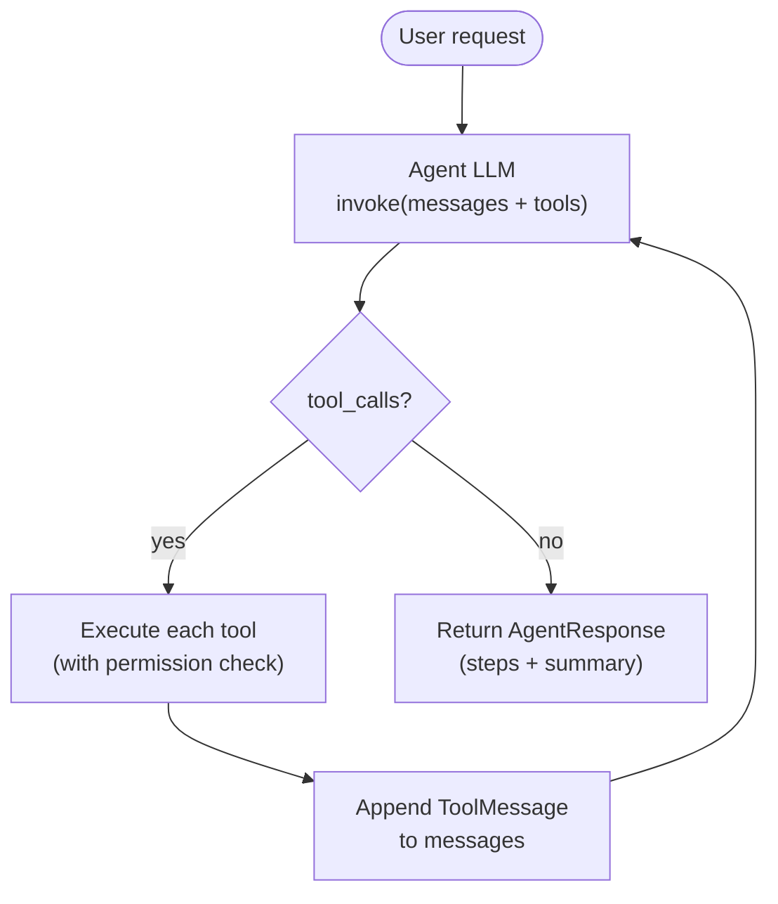

# Filesystem Agent

The filesystem agent is CodeMitra's first action agent. It can scaffold Python projects from scratch — creating directories, writing files, setting up virtual environments, and installing packages.

---

## How it is triggered

The chat LLM (`qwen2.5-coder:7b`) has a single routing tool bound to it: `setup_project`. When the user asks for anything filesystem-related, the chat LLM calls this tool, which hands off to the filesystem agent running on `qwen3.5:latest`.

```
User: "create a FastAPI project called myapi"
   ↓
Chat LLM → tool_call: setup_project(request="...")
   ↓
filesystem.run(agent_llm, request)
   ↓
Agent LLM plans steps → executes tools → returns AgentResponse
```

---

## Available tools

| Tool | Default | Args | What it does |
|---|---|---|---|
| `create_folder` | ✅ on | `path` | Create directory + any missing parents |
| `create_file` | ✅ on | `path, content` | Write a text file |
| `read_file` | ✅ on | `path` | Read a file's contents |
| `list_directory` | ✅ on | `path` | List files and sub-folders |
| `create_venv` | ✅ on | `project_path` | Run `python -m venv .venv` |
| `install_packages` | ✅ on | `project_path, packages?` | pip install into .venv |
| `delete_file` | ❌ off | `path` | Delete a single file |
| `delete_folder` | ❌ off | `path` | Delete folder recursively |
| `move_file` | ❌ off | `src, dest` | Move or rename |
| `run_command` | ❌ off | `command, cwd` | Run whitelisted shell command |

> [!warning] Destructive tools
> `delete_file`, `delete_folder`, `move_file`, and `run_command` are **off by default**. Enable them explicitly with `filesystem.configure()`.

---

## Agent loop



The loop runs until the LLM returns a response with no tool calls — that's the final summary.

---

## Permission guard

Every tool call passes through `PermissionGuard` before executing:

```python
# Lock agent to one directory
filesystem.configure(workspace="C:/Users/prash/projects/myapi")

# Unlock destructive tools too
filesystem.configure(
    workspace="C:/Users/prash/projects/myapi",
    allowed_tools=filesystem._DEFAULT_TOOLS | {"delete_file", "run_command"},
)
```

See [[reference/Permissions]] for full details.

---

## Response output

Every run returns an `AgentResponse` rendered as a Rich panel:

```
╭──────────────────── Setup Agent ────────────────────╮
│                                                     │
│  > create a FastAPI project called myapi            │
│                                                     │
│  steps ────────────────────────────────────────     │
│                                                     │
│  ✓  create_folder     myapi/src                     │
│  ✓  create_file       myapi/main.py                 │
│  ✓  create_venv       myapi                         │
│  ✓  install_packages  myapi [fastapi, uvicorn]      │
│                                                     │
│  summary ──────────────────────────────────────     │
│                                                     │
│  Created myapi/ with src/, main.py, a .venv,        │
│  and installed fastapi and uvicorn.                 │
│                                                     │
│    4 done  ·  0 errors                              │
╰─────────────────────────────────────────────────────╯
```

---

## Example prompts

```
create a folder called myapi with a src/ folder and install fastapi uvicorn
scaffold a Django project at C:/projects/mydjango
create a .venv in the current folder and install from requirements.txt
make a folder called scripts and add a file called run.sh
```
